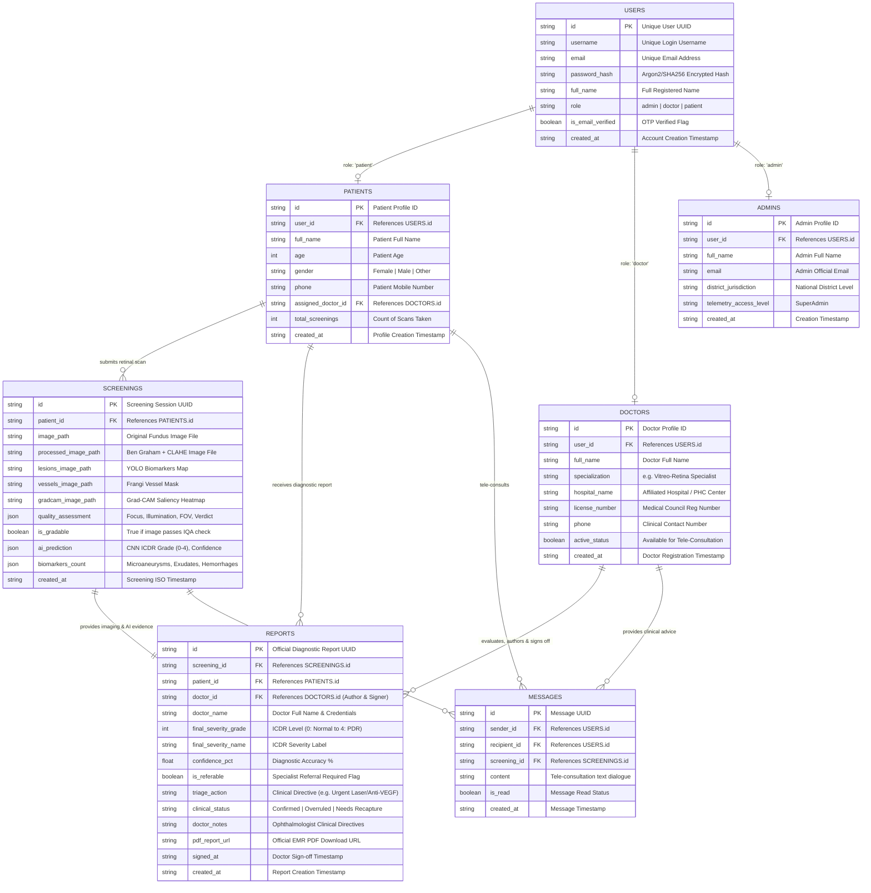

# NetraAI Tele-Ophthalmology Database & Data Architecture (ER Model)
**Database:** MongoDB Atlas Cloud Cluster (`NetraAI-db`)

---

## 1. Corrected Entity-Relationship (ER) Diagram

---

## 2. Explanation of Key Design Decisions

1. **Why `DOCTORS` is directly connected to `REPORTS`:**
   * A diagnostic report is a **legal medical document**. While AI provides evidence in `SCREENINGS`, the **Doctor** in `DOCTORS` evaluates, validates, enters clinical directives, and officially signs off on the report in `REPORTS`.

2. **Why Notifications were merged into `MESSAGES`:**
   * Having separate `notifications` and `messages` collections was redundant. All tele-consultations, doctor alerts, and clinical communications are now unified directly inside the **`messages`** collection.
